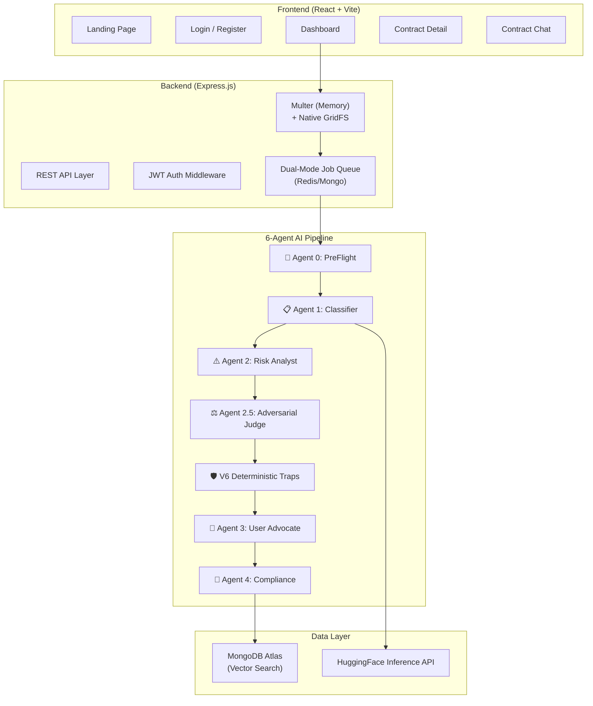
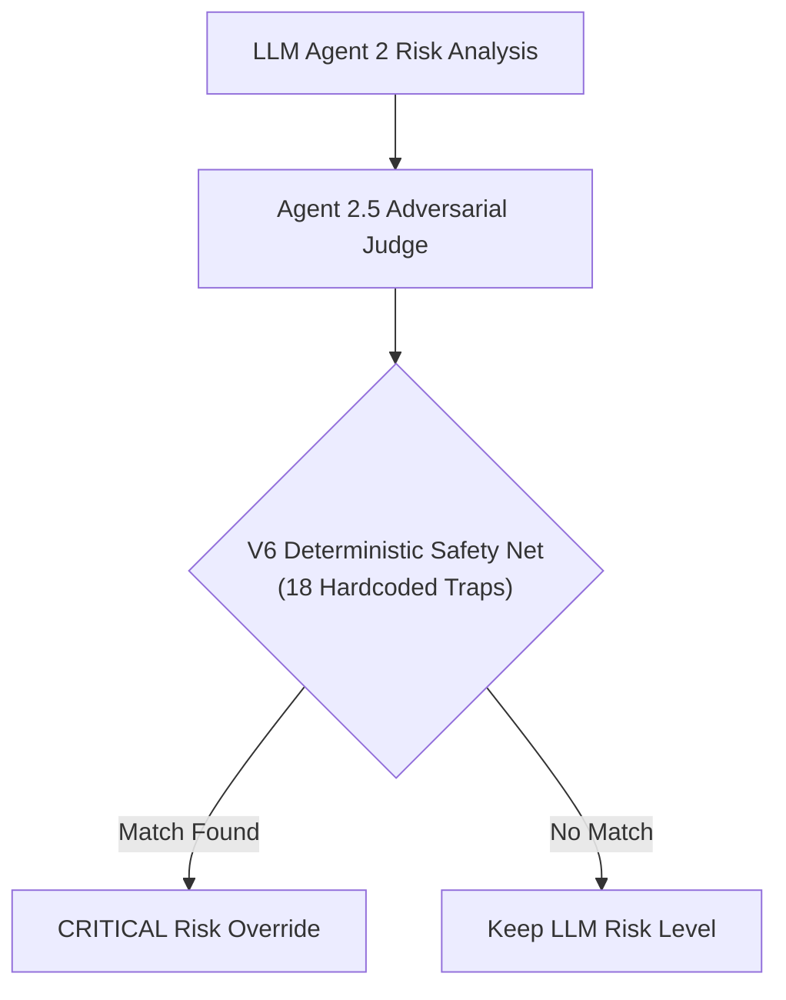
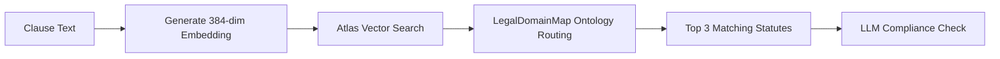

  <h1>🏛️ LexGuard</h1>
  
<strong>AI-Powered Legal Contract Intelligence Platform for Indian Jurisprudence</strong>

  
  
  
  
  

 

LexGuard is a full-stack, AI-powered legal contract intelligence platform built specifically to parse, analyze, and audit legal agreements under Indian law. It acts as an autonomous legal risk analyst, identifying predatory clauses and cross-referencing them against a massive vector database of Indian statutes and case law.

---

## ⚡ Features
- **Intelligent Parsing:** Supports PDF and DOCX files with a 3-tier fallback OCR strategy.
- **Multi-Agent Pipeline:** Orchestrates 6 specialized LLM agents (Classifier, Risk Analyst, Adversarial Judge, Advocate, Compliance Checker, Chat) for high-fidelity analysis.
- **Dual-Layer Defense:** LLM semantic analysis combined with an unbreakable **V6 Deterministic Safety Net** featuring 18 hard-coded legal trap tripwires.
- **RAG-Powered Compliance:** Injects real statutory text (from 7,500+ ingested Indian bare acts) directly into the agent prompts.
- **Serverless Resiliency:** Native memory-to-GridFS file streaming prevents BSON mismatch crashes on cloud platforms. Robust `rediss://` strict URL parsing ensures stable Upstash Redis connections.
- **Contract Chat:** Ask interactive questions about any uploaded contract.
- **Razorpay Integration:** Full freemium SaaS capabilities with usage quotas.

---

## 🏗️ System Architecture

LexGuard is built with a resilient, decoupled architecture emphasizing graceful degradation.

---

## 🛡️ The Dual-Layer V6 Defense

To prevent LLM hallucination and ensure absolute precision, LexGuard implements a mathematical safety net *after* the AI pipeline completes its risk analysis. The V6 layer uses strict keyword heuristics to catch 18 specific predatory traps.

### Key Traps Detected Automatically:
- Unilateral Force Majeure
- Pre-Existing IP Capture
- Unconscionable Indemnification
- Punitive Wage Forfeiture
- Broad Non-Solicitation (Global Scope)
- Excessive Liquidated Damages
- Evergreen Auto-Renewal
- POSH Arbitration Gag Orders
- Obfuscated Wage Deductions
- Ghost Jurisdiction / Tax Havens

---

## ⚙️ The RAG Pipeline

LexGuard doesn't guess the law—it searches for it. The platform uses a Retrieval-Augmented Generation (RAG) architecture powered by `all-MiniLM-L6-v2` embeddings and **MongoDB Atlas Vector Search**.

---

## 🚀 Deployment & Tech Stack

| Category | Technologies |
|:---|:---|
| **Frontend** | React 18, Vite, Vanilla CSS, Axios |
| **Backend** | Node.js, Express.js, JWT, Bcrypt |
| **Database** | MongoDB Atlas, Mongoose (Native GridFS Streaming) |
| **Caching / Queue** | Redis (with active MongoDB fallback polling) |
| **AI Inference** | HuggingFace Inference API (`meta-llama`) |
| **Embeddings** | `sentence-transformers/all-MiniLM-L6-v2` |
| **Document Parsing** | LlamaParse, `pdf-parse`, Tesseract OCR, Mammoth.js |
| **Payments** | Razorpay SDK |

---

## 🏆 Benchmark Performance

LexGuard runs against a rigorous CI/CD test suite, including a dedicated **"Heavy Benchmark"** of 10 hyper-obfuscated, adversarial legal traps designed specifically to manipulate AI.

### Master Calibration (30 Complex Cases)
- **Agent Classification Accuracy:** 100%
- **Risk Assessment Accuracy:** 100%
- **False Negatives:** 0

### Stress Test (10 Adversarial Traps)
- **Agent Classification Accuracy:** 100%
- **Risk Assessment Accuracy:** 100%
- **V6 Escalation Interventions:** 10/10 successfully blocked

> **Result:** A fully secure, enterprise-grade auditing engine with zero blind spots for critical legal loopholes.

---

   
  
Built for the complex realities of Indian Contract Law.

